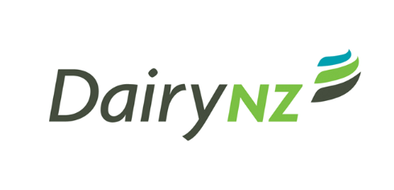
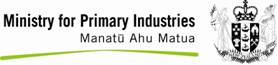

# New Zealand Farm Data Standards

* [FAQ]()
* [For Farmers]()
* [Farm Data Standards]()
  * [Animal Data Standard]()
  * [Land Application Data Standard]()
  * [Financial Data Standard]()
  * [Irrigation & Effluent Data Standard]()
  * [Stock Reconciliation Data Standard]()
  * [Farm Feature & Attributes Data Standard]()
  * [Pasture, Grazing & Feed Data Standard]()
  * [Farm & Model Data Standard]()
  * [Health & Safety Data Standard]()
* [Animal Breed List]()
* [Animal Feed List]()
* [URN Namespaces]()

### Building Consistency

##### Common Data Vocabularies promoting efficient data exchange.

The NZ Farm Data Standards are a set of common data vocabularies that assist the business and industry organisations that serve NZ farmers to develop efficient technology applications and integrations.

Aligning to these standards is an important step for organisations that aim to share farmer data for the benefit of their clients and/or for the wider industry.

Widespread alignment across the sector will mean that farmers can spend less time entering data for different farm systems, and more time utilising the valuable information from these systems to make better decisions on their farm.

The Farm Data Standards cover individual animal and mob data, stock reconciliations, farm financials and account coding, land applications, irrigation and effluent, feed and grazing and farm level data. New standards are developed in response to industry needs.

The Farm Data Standards is one of three data integration initiatives driven by the pastoral sector on behalf of farmers. The Farm Data Code of Practice, and the Data Linker are complementary tools aimed at getting data moving across the primary sector - securely, efficiently and within a transparent framework. The initiatives are funded by DairyNZ (through the Transforming the Dairy Value Chain programme), the Red Meat Profit Partnership and the Ministry of Primary Industries through the Primary Growth Partnership.

© New Zealand Farm Data Standards. All rights reserved.