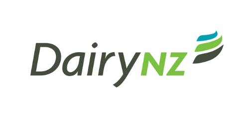

## The Health and Safety Data Standards

#### Outcome Statement

Broad adoption of a common vocabulary and data dictionary for exchange of farm information will result in farmers and other industry parties entering data only once and having that data readily accessible for populating multiple decision-making systems. As a result, industry and individual farm businesses will be better placed to undertake systems analysis to inform management practice. More accurate and structured interchange of farm data will also support industry performance objectives and other information system targets.

#### Scope and Application

This standard relates to the management of Health and Safety on farm.

The standard addresses:

* Hazards and Risks

* People and Roles 

* Events

### Topics

* [Identification of Observations](docs/HSDS_Identification-of-Observations.md)
* [Hazard Data Dictionary](docs/HSDS_Hazard-Data-Dictionary.md)
  * [Hazard Identification](docs/HSDS_Hazard-Data-Dictionary.md#Hazard-Identification)
  * [Hazard Types](docs/HSDS_Hazard-Data-Dictionary.md#Hazard-Types-–-Additional-Attributes)
* [People Data Dictionary](docs/HSDS_People-Data-Dictionary.md)
  * [Person Identification](docs/HSDS_People-Data-Dictionary.md#Person-Identification)
  * [Person Attributes](docs/HSDS_People-Data-Dictionary.md#Person-Attributes)
* [Event Data Dictionary](docs/HSDS_Event-Data-Dictionary.md)
  * [Event Identification](docs/HSDS_Event-Data-Dictionary.md#Event-Identification)
  * [Event Attributes](docs/HSDS_Event-Data-Dictionary.md#Event-Attributes)
  * [Accident, Incident or Near Miss Event](docs/HSDS_Event-Data-Dictionary.md#Accident,-Incident-or-Near-Miss-Event)

For more information about revisions and version updates, or to make suggestions for improvement, please visit our [Wiki Management](docs/HSDS_Wiki-Management.md) page.

#### Related Documents

Related standards documents on the Farm Data Standards website include: 

* [Farm Features and Attributes](docs/FFADS_Portal.md)

#### Acknowledgements

This document is part of a work stream focusing on Data Standards for interchanging health and safety information. Development of this Data Standard began with a workshop of interested parties in February 2016, followed by consultation with a wider group. 

Part funded by New Zealand dairy farmers by [DairyNZ](https://www.dairynz.co.nz/) and the [Ministry for Primary Industries](https://www.mpi.govt.nz/) through the [Primary Growth Partnership](https://www.mpi.govt.nz/funding-and-programmes/sustainable-food-and-fibre-futures/primary-growth-partnership/) funding to [Transforming the Dairy Value Chain](https://www.mpi.govt.nz/funding-and-programmes/sustainable-food-and-fibre-futures/primary-growth-partnership/completed-pgp-programmes/transforming-the-dairy-value-chain/). Part funded also by the [Red Meat Profit Partnership](https://www.rmpp.co.nz/) through its Primary Growth Partnership with Ministry for Primary Industries, [Alliance Group](https://www.alliance.co.nz/), [ANZCO Foods](https://anzcofoods.com/), [ANZ Bank](https://www.anz.com.au/personal/), [Beef + Lamb New Zealand Limited](https://beeflambnz.com/) (representing sheep and beef farmers), [Blue Sky Meats](https://bluesky.co.nz/), [Greenlea Premier Meats](https://www.greenlea.co.nz/), [Progressive Meats](https://www.progressivemeats.co.nz/), [Rabobank](https://www.rabobank.com/), and [Silver Fern Farms](https://www.silverfernfarms.com/). 

#### Referenced Documents 

European Petroleum Survey Group [(EPSG) parameter registry guide](http://www.iogp.org/pubs/373-07-3.pdf).

D2.9.111.5 INSPIRE  - Data Specification on Human Health and Safety – [Technical Guidelines](https://inspire.ec.europa.eu/id/document/tg/hh).

D2.8.III.9 INSPIRE - Data Specification on Agricultural and Aquaculture Facilities –
[Technical Guidelines](https://inspire.ec.europa.eu/id/document/tg/af).

Worksafe NZ - [Safer Farms](http://saferfarms.org.nz/).

Safer Farms - [Accident, Incident, or Near Miss report template](http://saferfarms.org.nz/assets/resources/WSNZ-2073-INCIDENT-NEAR-MISS-v7-FA1-1.pdf).

Environmental Protection Authority (EPA) – [HSNO2 Classification Codes](https://www.epa.govt.nz/industry-areas/hazardous-substances/rules-for-hazardous-substances/hazardous-substances-classification-codes/).

Wolfert, S and Allen, J. Farming for the future: Towards better information-based decision-making and communication. 2011. A Report for the Centre of Excellence in Farm Business Management pp 27.
