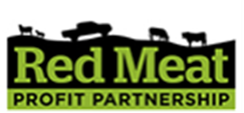

## Irrigation and Effluent Data Standard 

Broad adoption of a common vocabulary and data dictionary for exchange of farm information will result in farmers and other industry parties entering data only once and having that data readily accessible for populating multiple decision-making systems. As a result, industry and individual farm businesses will be better placed to undertake systems analysis to inform management practice. More accurate and structured interchange of farm data will also support industry breeding objectives and other information system targets.

#### Scope and Application

This standard addresses the following areas:

1.	Irrigation equipment and water supply
2.	Production, collection, storage, and treatment of effluent
3.	Irrigation and effluent application
4.	Characteristics of soil focusing on those related to soil moisture
5.	Use of water by plants
6.	Climatic observations relevant to irrigation and the spreading of effluent

### Topics
* [Identification of Observations](docs/IEDS_Identification-of-Observations.md)
  * [Location Identification](docs/IEDS_Identification-of-Observations.md#Location-Identification)
  * [Spatial Attributes](docs/IEDS_Identification-of-Observations.md#Spatial-Attributes)
* [Irrigation and Effluent Observations and Attributes](docs/IEDS_Irrigation-and-Effluent-Observations-and-Attributes.md)
  * [Irrigation Equipment and Water Supply](docs/IEDS_Irrigation-and-Effluent-Observations-and-Attributes.md#Irrigation-Equipment-and-Water-Supply)
  * [Production, collection, storage, and treatment of effluent](docs/IEDS_Irrigation-and-Effluent-Observations-and-Attributes.md#Production,-collection,-storage,-and-treatment-of-effluent)
  * [Irrigation and effluent application](docs/IEDS_Irrigation-and-Effluent-Observations-and-Attributes.md#Irrigation-and-effluent-application)
  * [Soil attributes and observations](docs/IEDS_Irrigation-and-Effluent-Observations-and-Attributes.md#Soil-attributes-and-observations)
  * [Use of water by plants](docs/IEDS_Irrigation-and-Effluent-Observations-and-Attributes.md#Use-of-water-by-plants)
  * [Climatic and Weather Observations](docs/IEDS_Irrigation-and-Effluent-Observations-and-Attributes.md#Climatic-and-Weather-Observations)

For more information about revisions and version updates, or to make suggestions for improvement, please visit our [Wiki Management](docs/IEDS_Wiki-Management.md) page.

#### Related Documents

Related standards documents to be published in 2014 on the Farm Data Standards website include:
* [Stock Reconciliation Data Standard](docs/SRDS_Portal.md)
* [Financial Data Standard](docs/FDS_Portal.md)

#### Acknowledgements

This document is part of a work stream focusing on Data Standards for interchanging land information for agriculture. Work on this project commenced in early 2013, funded by DairyNZ and with contributions from FarmIQ Systems and Rezare Systems. 

Part funded by New Zealand dairy farmers by [DairyNZ](https://www.dairynz.co.nz/) and the [Ministry for Primary Industries](https://www.mpi.govt.nz/) through the [Primary Growth Partnership](https://www.mpi.govt.nz/funding-and-programmes/sustainable-food-and-fibre-futures/primary-growth-partnership/) funding to [Transforming the Dairy Value Chain](https://www.mpi.govt.nz/funding-and-programmes/sustainable-food-and-fibre-futures/primary-growth-partnership/completed-pgp-programmes/transforming-the-dairy-value-chain/). Part funded also by the [Red Meat Profit Partnership](https://www.rmpp.co.nz/) through its Primary Growth Partnership with Ministry for Primary Industries, [Alliance Group](https://www.alliance.co.nz/), [ANZCO Foods](https://anzcofoods.com/), [ANZ Bank](https://www.anz.com.au/personal/), [Beef + Lamb New Zealand Limited](https://beeflambnz.com/) (representing sheep and beef farmers), [Blue Sky Meats](https://bluesky.co.nz/), [Greenlea Premier Meats](https://www.greenlea.co.nz/), [Progressive Meats](https://www.progressivemeats.co.nz/), [Rabobank](https://www.rabobank.com/), and [Silver Fern Farms](https://www.silverfernfarms.com/). 

#### Referenced Documents 
[Irrigation Code of Practice and Irrigation Design Standards](http://www.noic.co.nz/files/Irrigation-design-COP.pdf), Irrigation New Zealand Inc and Sustainable Farming Fund, March 2007

[Irrigation Glossary Book 2](http://irrigationnz.co.nz/product/irrigation-glossary/), Irrigation New Zealand, 2013

[Guide to Agricultural Meteorological Practices (GAMP) 2010 Edition (WMO-No.134) Updated in 2012](http://www.wmo.int/pages/prog/wcp/agm/gamp/gamp_en.php), World Meteorological Organisation 

[Guide to Climatological Practices WMO-No. 100 (third edition), Chapter 4 Characterizing Climate from Datasets](http://www.wmo.int/pages/prog/wcp/ccl/guide/documents/english/WMO_100_en-chap4.pdf), World Meteorological Organisation

[OGC® WaterML](http://www.opengeospatial.org/standards/waterml), Open Geospatial Consortium

INSPIRE Data Specification on Administrative Units – [Technical Guidelines] (https://inspire.ec.europa.eu/id/document/tg/au)

[International System of Units](https://en.wikipedia.org/wiki/International_System_of_Units)
