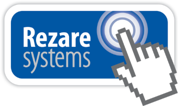

## Pasture, Grazing and Feed Data Standard

Broad adoption of a common vocabulary and data dictionary for exchange of farm information will result in farmers and other industry parties entering data only once and having that data readily accessible for populating multiple decision-making systems. As a result, industry and individual farm businesses will be better placed to undertake systems analysis to inform management practice. More accurate and structured interchange of farm data will also support industry breeding objectives and other information system targets.

#### Scope and Application

This standard addresses the following areas:
* Harvesting, purchase, storage, utilisation and sale of supplementary feeds.
* Grazing observations and summaries of grazing off and grazing systems
* Pasture growth, pasture, and feed analysis
* Monitoring of pasture pests and weeds.

### Topics

* [Identification of Farm and Mobs](docs/PGFDS_Identification-of-Farm-and-Mobs.md)
* [Pasture, Grazing and Feed Observations](docs/PGFDS_Pasture-Grazing-and-Feed-Observations.md)
* [Pasture, Grazing and Feed Data Dictionary](docs/PGFDS_Pasture_Grazing_and_Feed_Data_Dictionary.md)
* [Lists of Valid Values](docs/PGFDS_Lists-of-Valid-Values.md)

For more information about revisions and version updates, or to make suggestions for improvement, please visit our [Wiki Management](docs/PGFDS_Wiki-Management.md) page.

#### Related Documents

Related Data Standard documents on the Farm Data Standards website include:

* [Animal data standard](docs/ADS_Portal.md)
* [Stock Reconciliation data standard](docs/SRDS_Portal.md)
* [Land Application data standard](docs/LADS_Portal.md)
* [Irrigation & Effluent data standard](docs/IEDS_Portal.md)

#### Acknowledgements

This document is part of a work stream focusing on Data Standards for interchanging land information for agriculture. Work on this project commenced in early 2013, funded by DairyNZ with contributions from FarmIQ Systems and Rezare Systems. 

Part funded by New Zealand dairy farmers by [DairyNZ](https://www.dairynz.co.nz/) and the [Ministry for Primary Industries](https://www.mpi.govt.nz/) through the [Primary Growth Partnership](https://www.mpi.govt.nz/funding-and-programmes/sustainable-food-and-fibre-futures/primary-growth-partnership/) funding to [Transforming the Dairy Value Chain](https://www.mpi.govt.nz/funding-and-programmes/sustainable-food-and-fibre-futures/primary-growth-partnership/completed-pgp-programmes/transforming-the-dairy-value-chain/). Part funded also by the [Red Meat Profit Partnership](https://www.rmpp.co.nz/) through its Primary Growth Partnership with Ministry for Primary Industries, [Alliance Group](https://www.alliance.co.nz/), [ANZCO Foods](https://anzcofoods.com/), [ANZ Bank](https://www.anz.com.au/personal/), [Beef + Lamb New Zealand Limited](https://beeflambnz.com/) (representing sheep and beef farmers), [Blue Sky Meats](https://bluesky.co.nz/), [Greenlea Premier Meats](https://www.greenlea.co.nz/), [Progressive Meats](https://www.progressivemeats.co.nz/), [Rabobank](https://www.rabobank.com/), and [Silver Fern Farms](https://www.silverfernfarms.com/). 

#### Referenced Documents

Wolfert, S and Allen, J. Farming for the future: Towards better information-based decision-making and communication. 2011. A Report for the Centre of Excellence in Farm Business Management.

EPCglobal SGLN and GLN – [GDSN Standards](http://www.gs1.org/access-gdsn-standards).

Massey University  - [New Zealand Weeds Database](http://www.massey.ac.nz/massey/learning/colleges/college-of-sciences/clinics-and-services/weeds-database/weeds-database_home.cfm).

AsureQuality - [AgriBase](https://www.asurequality.com/our-solutions/agribase/).

[INSPIRE Feature Concept Register](http://inspire.ec.europa.eu/featureconcept).

INSPIRE Data Specification on Administrative Units – [Technical Guidelines](https://inspire.ec.europa.eu/id/document/tg/au).

[International System of Units](https://en.wikipedia.org/wiki/International_System_of_Units).
